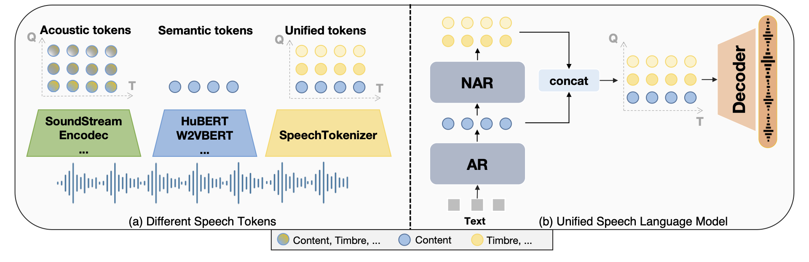

# USLM: Unified Speech Language Model
<a href='https://github.com/ZhangXInFD/SpeechTokenizer'></a>  <a href='https://arxiv.org/abs/2308.16692'></a>

## Introduction
Build upon [SpeechTokenizer](https://github.com/ZhangXInFD/SpeechTokenizer), USLM consists of autoregressive and non-autoregressive models, it can hierarchically model information in speech. The autoregressive (AR) model captures the content information by modeling tokens from the first RVQ quantizer. The non-autoregressive (NAR) model complements paralinguistic information for the AR model by generating tokens from the subsequent quantizers conditioned on the first-layer tokens.

<br>
<p align="center">
     <br>
    Overview
</p>

## Installation

To get up and running quickly just follow the steps below:

```
# PyTorch
pip install torch==1.13.1 torchaudio==0.13.1 --extra-index-url https://download.pytorch.org/whl/cu116
pip install torchmetrics==0.11.1
# fbank
pip install librosa==0.8.1

# phonemizer pypinyin
apt-get install espeak-ng
## OSX: brew install espeak
pip install phonemizer==3.2.1 pypinyin==0.48.0

# lhotse update to newest version
# https://github.com/lhotse-speech/lhotse/pull/956
# https://github.com/lhotse-speech/lhotse/pull/960
pip uninstall lhotse
pip install git+https://github.com/lhotse-speech/lhotse

# k2
# find the right version in https://huggingface.co/csukuangfj/k2
pip install https://huggingface.co/csukuangfj/k2/resolve/main/cuda/k2-1.23.4.dev20230224+cuda11.6.torch1.13.1-cp310-cp310-linux_x86_64.whl

# icefall
git clone https://github.com/k2-fsa/icefall
cd icefall
pip install -r requirements.txt
export PYTHONPATH=`pwd`/../icefall:$PYTHONPATH
echo "export PYTHONPATH=`pwd`/../icefall:\$PYTHONPATH" >> ~/.zshrc
echo "export PYTHONPATH=`pwd`/../icefall:\$PYTHONPATH" >> ~/.bashrc
cd -
source ~/.zshrc

#SpeechTokenizer
pip install -U speechtokenizer

# uslm
git clone https://github.com/0nutation/USLM
cd USLM
pip install -e .
```

## USLM Models
This version of USLM is trained on the LibriTTS dataset, so the performance is not optimal due to data limitations.

| Model| Dataset |Discription|
|:----|:----:|:----|
|[USLM_libri](https://huggingface.co/fnlp/USLM/resolve/main/USLM_libritts/)|LibriTTS|USLM trained on LibriTTS dataset |


## Zero-shot TTS Using USLM
Download pre-trained SpeechTokenizer models:
``` bash
st_dir="ckpt/speechtokenizer/"
mkdir -p ${st_dir}
cd ${st_dir}
wget "https://huggingface.co/fnlp/SpeechTokenizer/resolve/main/speechtokenizer_hubert_avg/SpeechTokenizer.pt"
wget "https://huggingface.co/fnlp/SpeechTokenizer/resolve/main/speechtokenizer_hubert_avg/config.json" 
cd -
```

Download pre-trained USLM models:
``` bash
uslm_dir="ckpt/uslm/"
mkdir -p ${uslm_dir}
cd ${uslm_dir}
wget "https://huggingface.co/fnlp/USLM/resolve/main/USLM_libritts/USLM.pt"
wget "https://huggingface.co/fnlp/USLM/resolve/main/USLM_libritts/unique_text_tokens.k2symbols" 
cd -
```

Inference:
``` bash
out_dir="output/"
mkdir -p ${out_dir}

python3 bin/infer.py --output-dir ${out_dir}/ \
    --model-name uslm --norm-first true --add-prenet false \
    --share-embedding true --norm-first true --add-prenet false \
    --audio-extractor SpeechTokenizer \
    --speechtokenizer-dir "${st_dir}" \
    --checkpoint=${uslm_dir}/USLM.pt \
    --text-tokens "${uslm_dir}/unique_text_tokens.k2symbols" \
    --text-prompts "mr Soames was a tall, spare man, of a nervous and excitable temperament." \
    --audio-prompts prompts/1580_141083_000002_000002.wav \
    --text "Begin with the fundamental steps of the process. This will give you a solid foundation to build upon and boost your confidence. " \
```

or you can directly run inference.sh
``` bash
bash inference.sh
```

## Acknowledge
[VALL-E](https://github.com/lifeiteng/vall-e): The codebase we build upon.

## Citation
If you use this code or result in your paper, please cite our work as:
```Tex
@misc{zhang2023speechtokenizer,
      title={SpeechTokenizer: Unified Speech Tokenizer for Speech Language Models}, 
      author={Xin Zhang and Dong Zhang and Shimin Li and Yaqian Zhou and Xipeng Qiu},
      year={2023},
      eprint={2308.16692},
      archivePrefix={arXiv},
      primaryClass={cs.CL}
}
```